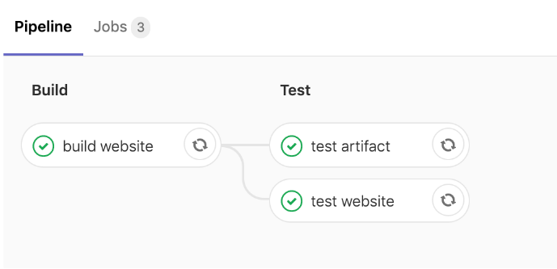
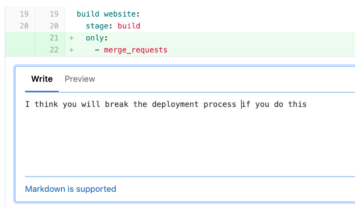
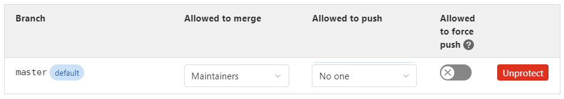

# Content

<ul>
    <li><a href="#gitlab commands">GitLab Commands</a></li>
    <li><a href="https://docs.gitlab.com/ee/ci/variables/predefined_variables.html">GitLab Predefined Variables</a></li>
    <li><a href="https://www.atlassian.com/agile/software-development/code-reviews">Code Reviews</a></li>
</ul>

# Introduction to GitLab

### GitLab CI Basic Notes for Pipeline

- `.gitlab-ci.yml` file is used to **define a pipeline**.
- `.yaml` is a data serialization standard for all programming languages, and is used by GitLab.
- A job contains at least 1 script that will be executed.
- Pipeline will only work if `.gitlab-ci.yml` of the repository.
- Gitlab CI will automatically assign jobs to the "test" stage, even if no test stage was defined.
- Files created or modified by **one job** will NOT be commited in the repository.
- **GitLab Runner** is the tool responsible for actually running the commands defined in a job.

### GitLab Pipeline

- BUILD --> TEST

```
# build jobs in the same stage run in parallel
# Jobs in the next stage run after the jobs from the previous stage complete successfully.
stages:
    - build
    - test

# job in pipeline
build the car:
    stage: build
    script:
        - mkdir build
        - cd build
        - echo "chassis" >> car.txt
        - echo "engine" >> car.txt
        - echo "wheels" >> car.txt
    # artifact repository (keep after process)
    artifacts:
        paths:
            # save the entire folder
            - build/

test the car:
    stage: test
    script:
        # test the existence of the file
        - test -f build/car.txt
        - cd build
        # grep : search for a text in the file
        - cat car.txt
        - grep "chassis" car.txt
        - grep "engine" car.txt
        - grep "wheels" car.txt

```

### Why GitLab CI?

- Simple, Scalable architecture.
- Docker first approach.
- Pipeline as code.
- Merge requests with CI support.

### Exit Code

- `0` : script marked as successful by GitLab Runner (`Job Succeeded`)
- `1 - 255` : job failed. (`ERROR: Job failed: exit code 1`)

### Debugging

- Use `ls` and `cat <filename>` for debugging.

# Basic CI/CD workflow with GitLab CI

### Continuous Integration (CI)

- Integrating code with other developers.
- Practice of continuously integrating code changes.
- Ensures that the project can still be built/compiled.
- Ensures that any changes **pass all tests**, guidelines, and code compliance standards.
- Code changes are integrated automatically.

### Advantages of Continuous Integration (CI)

- Errors are detected early in the development process.
- Reduces integration problems.
- Allows developers to work faster. (detects bugs, errors during the integration process.)

### Continuous Delivery (CD) 

- Ensures that the software can be **deployed anytime to production**.
- Commonly, the latest verison is deployed to a **testing or staging system**.

### Advantages of Continuous Delivery and Continuous Deployment (CD)

- **Ensures that every change is releasable** by testing that it can be deployed.
- Reduced risk of a new deployment.
- Delivers value much faster to the market (competitive advantage, happy customers).

### The Build Step

- Most projects have a **production build step**.
- Developers write code in human readable programming languages (like C, Java, Ruby, JavaScript).
- The **source code needs to be processed further so it can be deployed** (for example, to a production server).

### Docker for Continuous Integration Servers

- Modern CI Server that can run on 2 different versions of E.g., nodeJS 8 and nodeJS 10.
- Specify the use of a specific image.

### Running Jobs in parallel

- `curl "http://localhost:9000" | grep -q "Gatsby"`
- Running jobs in parallel might increase performance and optimise the entire system.
- **Jobs in the same stage** run in parallel.

### What is `surge.sh`

- Cloud platform for **serverless** deployments.
- Easy to use and configure.
- Simple **deployment** process.
- Ideal for **static websites**.

### Environment Variables

- Do not keep any secrets, credentials, usernames in your pipeline or project files.
- With GitLab, you can define **environment variables** that will be available when running the pipeline.
- Environment variables are **ideal for storing secrets** when working with GitLab CI.
- To add environment variables on gitlab.com, **Settings --> CI/CD --> Variables --> Expand**.
- The name for the environment variables must be exact to the program you are using so gitlab automatically looks for them. e.g., SURGE_LOGIN or SURGE_TOKEN

# GitLab CI Fundamentals

### Predefined Environment Variables

|Predefined Variables|Description|
|:-:|:-:|
|`CI_COMMIT_SHORT_SHA`|The first 8 characters of `CI_COMMIT_SHA`, i.e., the commit revision for which project is built.|

- To replace a string inside a file like `index.js`, use the *sed* stream editor.

#### *sed* - stream editor
- for filtering and transforming text
- `sed -i 's/word1/word2/g' inputfile`
- `-i` for edit in place (edit the same file, don't create a new one)
- `s` for substitute (sed looks into the specified file and replaces 'word1' with 'word2')
- `g` for global replacement

### Scheduling Pipelines

- CI/CD --> Schedules
- The pipelines schedule runs pipelines in the future, repeatedly, for specific branches or tags.
- Those scheduled pipelines will inherit limited project access based on their associated user.

### Using Caches to optimize the build speed

- **Downloading dependencies** takes significant portion of the execution time. 
- "Traditional" CI servers like Jenkins do not delete the temporary data after the execution finishes, resulting in a better execution time. 
- The `build` process takes a long time, so it's better to use the cache data.
- Cache in GitLab Runner so the Jobs can run faster.
- Clear GitLab cache by clicking `Clear Runner Caches`.

|Common Steps needed to run a job|
|:-:|
|Delegate job to a GitLab Runner|
|Download & start Docker image|
|Clone the repository|
|Install any required dependencies|
|**Run the actual step**|
|**Save the result (if needed)**|

```
# Make the cache globally (other jobs can use this)
cache:
  # key to identify when we can use this cache
  key: ${CI_COMMIT_REF_SLUG}  # predefined variable
  # save the node_modules
  paths:
    - node_modules/
```

### Setting a policy

- `policy: pull` allows us to skip uploading cache file.
- While downloading the cache (pull) saves us time, we still have a few jobs that do redundant work: updating the cache after each run (push). This cost time and is not needed because the cache remains the same.
- The chance of a npm dependency changing during the execution of the pipeline is very small.

### `schedules`

- `only: - schedules`: Create jobs that are only executed when a specific condition is fulfilled.
- For example, if we want to run a job only when the pipeline is triggered by a schedule.

```
only:
    - schedules
```

- `except: - schedules`: If we don't want to run a job when the pipeline is triggered by a schedule run.

```
except:
    - schedules
```

### Cache vs Artifacts

|Cache|Artifacts|
|:-:|:-:|
|Caches are not used to store build results|An artifact is usually the output of a build tool.|
|Cache should only be used as a temporary <br> storage for project dependencies.|In GitLab CI, artifacts are designed to save some <br> compiled/generated part of the build.|
|-|Artifacts can be used to pass data between stages/jobs.|

### Environments in GitLab

- Environments allow you to **control the continuous delivery / deployment process**.
- Easily **track deployments**.
- You will know exactly **what was deployed** and on **which environment**.
- You will have a **full history** of your deployments.
- In GitLab, DEPLOYMENT --> ENVIRONMENT

### Defining variables

```
variables:
  STAGING_DOMAIN: puzzled-staging.surge.sh
  PRODUCTION_DOMAIN: puzzled-production.surge.sh
```

### Manually deployment / Manually Triggering Jobs
```
# Manual deployments / Manually triggering jobs
when: manual
# does not allow the steps after `deploy production` to fail
allow_failure: false
```

# Merge Requests

### Using Branches

- Avoids breaking the master
- Breaking the master branch is **costly** and should be avoided.
- Ensures that CD is always possible.
- Each feature / task / bugfix could be done on a separate branch. 
- Once the work is done, tested and reviewed, it can be **merged back to master**. This ensures that the master branch is always deployable.
- Avoid branching the production or staging stream.
- In GitLab, `REPOSITORY --> BRANCHES` (To create a branch)

```
# production job
deploy production:
  # this job only executes on master branch
  only:
    - master
```

### Branching Models

- The most known strategy is using **GitFlow**.
- **Avoid using only one branch**.

### What is a Merge Request?

- **Merge Requests** are a good way to visualize new changes that are about to be made in the master branch.
- Instead of making changes directly into master, the Merge Request workflow allows you to:
    - allow others to review the changes.
    - allows the pipeline to run once without affecting others or the master branch.
    - allows for additional changes to be made.
- can see the **status of the pipeline` for a specific branch.

- can give other developers feed back regarding a feature/fix before it gets merge into master.


### Configuring GitLab

- `SETTINGS --> REPOSITORY --> PROTECTED BRANCH`
    - Set "Allowed to push" to "no one", so cannot push to master branch, only merge requests are allowed.
    

- `SETTINGS --> MERGE REQUESTS`
    - Set `Fast-Forward merge` so merge commit are not created (cleaner look in your setup).
    - Set `Pipelines must success` in merge checks.

### Only job policy

- [Optional] Can mark the jobs for the build & test stages with the *following only job policy*
- This will make it **explicit** on which cases/branches will this job be executed.
- While it is theoretically possible to **reuse** the artifact that was built inside the branch (and avoid running the build and test stages for the master branch) for the moment we will just recreate it when running the master pipeline.

### Dynamic Environments

- **Staging and Production** are for the **master branch**.
- To deploy a branch to the environment, we also need another environment (AKA environment review).
- As we actually work with multiple branches at a time, we need to **dynamically create environments for each branch**.
- As each Merge Request / branch is deployed to an environment, we can easily **review the changes made**.
- Sometimes it makes sense to **run additional tests** on a system that was deployed.
- **Changes can be reviewed by non-developers** as well (Testers, Product Owners / Project Managers, Domain Experts and so on.)
- Dynamic environment for every merge request.

### Destroying environments

- `

<h1 id="gitlab commands">GitLab Commands</h1>

|      Script Commands       |                                                                             Description                                                                             |
| :------------------------: | :-----------------------------------------------------------------------------------------------------------------------------------------------------------------: |
|    `test -f <filename>`    |     `test` command is used to verify that the file car.txt was created. <br> `-f` flag is needed to check that the specified file exists and is a regular file.     |
| `grep "wheels" <filename>` | `grep` command is used for searching lines that match a regular expression. <br> It does a global search with the regular expresison and prints all matching lines. |
|      `echo "text" >>`      |                                                                          to append content                                                                          |
|      `echo "text" >`       |                                                                         to replace content                                                                          |
|`grep -q "jiewei" <filename>`|Quiet mode does not give any output.|
|`echo $?`|Used after the `grep -q` code. Returns 1 if doesnt exist and 0 if exist.|
|`- curl "http://localhost:9000" \| grep -q "Gatsby"`|**Pipes** let you use the output of a program as the input of another program. <br> The standard syntax for pipes is to list multiple commands, separated by vertical bars.|
|`sleep 3`|Include a small number of second before the next command starts. <br>Mainly to allow server more time to start E.g., wait 3 seconds.|
|`curl "url" \| tac \| tac \| grep -qs foo`|`tac` is a simple Unix program that reads the entire input page and <br> reverses the line order (hence we run it twice).|

